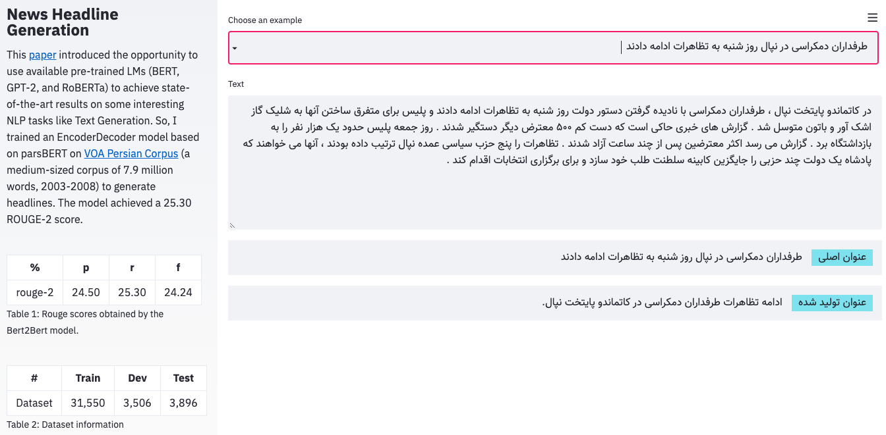

# News Headline Generation

This [paper](https://arxiv.org/abs/1907.12461) introduced the opportunity to use available pre-trained LMs (BERT, GPT-2, and RoBERTa) to achieve state-of-the-art results on some interesting NLP tasks like Text Generation.
So, I trained an EncoderDecoder model based on parsBERT on [VoA Persian Corpus](https://jon.dehdari.org/corpora/#persian) (a medium-sized corpus of 7.9 million words, 2003-2008) to generate headlines.
The model achieved a 25.30 ROUGE-2 score.

[](https://youtu.be/gs4PdKUxoKk)

## Dataset information
The dataset includes the Persian news between 2003-2008 from VoA News Network. In this particular example, I cleaned the dataset into pairs of articles and headlines and reduced the articles' length to a maximum of 512, suitable for parsBERT. 
Also, for making things simple, converted the dataset into the [HuggingFace' datasets](https://github.com/m3hrdadfi/news-headline-generation/tree/master/datasets), which is available in the [repo](https://github.com/m3hrdadfi/news-headline-generation/tree/master/datasets).
Or you can access the `csv` format here:
- [Train Set](https://drive.google.com/uc?id=1-9Tf8-Jyzg8qsZwYRGU_DghyaxFdU5F_)
- [Dev Set](https://drive.google.com/uc?id=1-BUxuBqSPCWc0xgbENyjVsu1MJHksOJy)
- [Test Set](https://drive.google.com/uc?id=1-AAzeSnzJO-f0ti_EYhqVOSx2qdVWVud)

|    #    | Train |  Dev | Test |
|:-------:|:-----:|:----:|:----:|
| Dataset | 31,550 | 3,506 | 3,896 |

## Evaluation
The following table summarizes the ROUGE scores obtained by the Bert2Bert model.

|    %    | Precision | Recall | FMeasure |
|:-------:|:---------:|:------:|:--------:|
| ROUGE-1 |   43.78   |  45.52 |   43.54  |
| ROUGE-2 |   24.50   | 25.30* |   24.24  |
| ROUGE-L |   41.20   |  42.22 |   40.76  |

## How to use

### HuggingFace Transformers
```python
from transformers import (
    BertTokenizerFast,
    EncoderDecoderConfig,
    EncoderDecoderModel
)

model_name = 'm3hrdadfi/bert2bert-fa-news-headline'
tokenizer = BertTokenizerFast.from_pretrained(model_name)
config = EncoderDecoderConfig.from_pretrained(model_name)
model = EncoderDecoderModel.from_pretrained(model_name, config=config)

sequence = """YOUR TEXT COMES HERE"""
inputs = tokenizer([sequence], padding="max_length", truncation=True, max_length=512, return_tensors="pt")
input_ids = inputs.input_ids
attention_mask = inputs.attention_mask

outputs = model.generate(input_ids, attention_mask=attention_mask)
generated = tokenizer.batch_decode(outputs, skip_special_tokens=True)
print(f'YOUR GENERATED TEXT: {generated}')
```

### Streamlit Application on Google-Colab
Follow the block steps on this Colab notebook.

[](https://colab.research.google.com/github/m3hrdadfi/news-headline-generation/blob/master/notebooks/How_to_use_app.ipynb) 

## Cite 
I didn't publish any paper about this work. Please cite this repository in publications as the following:

```markdown
@misc{Bert2BertFaNewsHeadline,
  author = {Mehrdad Farahani},
  title = {News Headline Generation using Bert2Bert model},
  year = {2020},
  publisher = {GitHub},
  journal = {GitHub repository},
  howpublished = {https://github.com/m3hrdadfi/news-headline-generation},
}
```

## Releases
v1: Hello World!

Available by: [m3hrdadfi/bert2bert-fa-news-headline](https://huggingface.co/m3hrdadfi/bert2bert-fa-news-headline)


## License
[Apache License 2.0](LICENSE)
